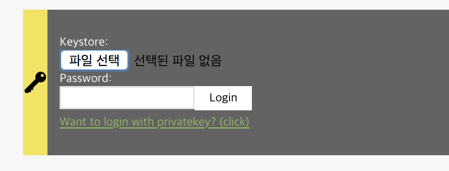

`src/components/Auth.js`:  

## `Auth` component
1) Background  
2) `Auth` component overview  
3) `Auth` component feature: User can input private key to login.  
4) `Auth` component feature: User can import keystore file and input password to login.  
5) `Auth` component feature: User can logout, remove wallet instance information from browser.  

### 1) Background
In blockchain based app, we usually interact with contract.  
What does mean interacting with contract?  
Basically, there are just 2 options to interact with contract.  
`1) Read data from contract.`
`2) Write data to contract.`

It is cost-free to read data from contract.  
On the otherhand, there is cost for writing data to contract(Sending a transaction).  

cf) `Sending a transaction`  
It is called `Sending a transaction` for writing data to contract or blockchain.  
For example, if you send a 1000 KLAY to your friend, you could think of it as `Write a data that I sent 1000 KLAY to my friend to blockchain`.  
Call a contract method is same. You could think of it as `Write a data to contract that I set variable X's value to 100`  All actions related to writing data to blockchain(contract) is called `Sending a transaction`.


By this reason, to write data to contract, you should have klaytn account which has KLAY to pay for it.   
`Auth` component helps you login to your app to pay for transaction fee.

\* There are some application for logging your wallet instance to blockchain based app, for example, in Ethereum, Metamask do this role, in EOS, Scatter do this role.  Currently, in Klaytn, we only support `Auth.js` component for logging in your blockchain based app. Later there will be more easy, not complicated method to login your app in Klaytn.

### 2) `Auth` component overview
`'Auth.js'` component is longest code in our tutorial app, so we will break codes into step by step.  

It looks like below.  


This component features are like below:  
1) User can input private key to login.  
2) User can import keystore file and input password to login.  
3) User can logout, remove wallet instance information from browser.  

### 3) `Auth` component feature: User can input private key to login.
`integrateWallet` method is needed to login with private key.
```js
integrateWallet = (privateKey) => {
  const walletInstance = cav.klay.accounts.privateKeyToAccount(privateKey)
  cav.klay.accounts.wallet.add(walletInstance)
  sessionStorage.setItem('walletInstance', JSON.stringify(walletInstance))
  this.reset()
}
```
`integateWallet` function takes `privateKey` as an argument, use it to make wallet instance.  

Line 1: `const walletInstance = cav.klay.accounts.privateKeyToAccount(privateKey)`  
It stores wallet instance made by `privateKeyToAccount` API to `walletInstance` variable.  

Line 2: `cav.klay.accounts.wallet.add(walletInstance)`  
To send a transaction, you should add wallet instance to caver through `cav.klay.accounts.wallet.add(walletInstance)`.

Line 3: `sessionStorage.setItem('walletInstance', JSON.stringify(walletInstance))`  
`sessionStorage.setItem` is browser's API for storing value to browser's session storage.  
Since we want to not lose our logged-in status even we refresh our tutorial app page, we stored it our wallet instance to session storage as JSON string.  

cf) Items in session storage disappear when user close the browser tab.  

Line 4: `this.reset()`  
It reset current component's state to initial state to clear your input on which private key is typed.  

For further information about `privateKeyToAccount` API of caver, visit klaytn document site https://docs.klaytn.net/api/toolkit/caverjs/caver.klay.accounts#privatekeytoaccount  

### 4) `Auth` component feature: User can import keystore file and input password to login.
`handleImport`, `handleLogin` methods are needed to login with keystore + password
```js
/**
 * handleImport method takes a file, read
 */
handleImport = (e) => {
  const keystore = e.target.files[0]
  // 'FileReader' is used for reading contents of file.
  // We would use 'onload' handler and 'readAsText' method.
  // * FileReader.onload
  // - This event is triggered each time the reading operation is completed.
  // * FileReader.readAsText()
  // - Starts reading the contents.
  const fileReader = new FileReader()
  fileReader.onload = (e) => {
    try {
      if (!this.checkValidKeystore(e.target.result)) {
        // If key store file is invalid, show message "Invalid keystore file."
        this.setState({ keystoreMsg: 'Invalid keystore file.' })
        return
      }

      // If key store file is valid,
      // 1) set e.target.result keystore
      // 2) show message "It is valid keystore. input your password."
      this.setState({
        keystore: e.target.result,
        keystoreMsg: 'It is valid keystore. input your password.',
      }, () => document.querySelector('#input-password').focus())
    } catch (e) {
      this.setState({ keystoreMsg: 'Invalid keystore file.' })
      return
    }
  }
  fileReader.readAsText(keystore)
}
```

To import file from user, we need `FileReader` browser API.  
`e.target.files[0]` contains meta information for file. To read contents of the file, we need `fileReader.readAsText(keystore)` API.  
After calling `fileReader.readAsText(keystore)`, `fileReader.onload` function fires to take the content of file as `e.target.result`.  
Importing keystore is not enough to login, since it needs password to decrypt keystore.  
So after importing keystore file, we still need to input password.  

cf) keystore contains encrypted private key, we can't know actual private key only with keystore file.  
We need to decrypt it through password so that we can export actual private key(decrypted) from keystore.  
*WARNING Don't expose your keystore file to another person!*

Fill password into `<input>` element. filled value will be stored as `password` state through `handleChange` method.  
```html
<input
  id="input-password"
  className="Auth__passwordInput"
  name="password"
  type="password"
  onChange={this.handleChange}
/>
```

If keystore file and password are ready, we can decrypt keystore file to export private key through `cav.klay.accounts.decrypt(keystore, password)` API.  
This API returns wallet instance containing private key. After exporting private key, we can use `integrateWallet` method we've seen before.  

```js
handleLogin = () => {
  const { accessType, keystore, password, privateKey } = this.state

  // Access type2: access thorugh private key
  if (accessType == 'privateKey') {
    this.integrateWallet(privateKey)
    return
  }

  // Access type1: access through keystore + password
  try {
    const { privateKey: privateKeyFromKeystore } = cav.klay.accounts.decrypt(keystore, password)
    this.integrateWallet(privateKeyFromKeystore)
  } catch (e) {
    this.setState({ keystoreMsg: `Password doesn't match.` })
  }
}
```

For further information about decrypting keystore file with password, visit klaytn document site https://docs.klaytn.net/api/toolkit/caverjs/caver.klay.accounts#decrypt  

### 5) `Auth` component feature: User can logout, remove wallet instance information from browser.
'logout' means remove wallet instance from browser and caver.  
We can remove wallet instance from caver through `cav.klay.accounts.wallet.clear()` which removes all wallet instance from caver.  
We can remove wallet instance stringified as JSON from browser's session storage through `sessionStorage.removeItem('walletInstance')`.  

```js
/**
 * removeWallet method removes
 * 1) wallet instance from caver.klay.accounts
 * 2) 'walletInstance' value from session storage.
 */
removeWallet = () => {
  cav.klay.accounts.wallet.clear()
  sessionStorage.removeItem('walletInstance')
  this.reset()
}
```

For further information about clearing wallet instance from caver, visit klaytn document site https://docs.klaytn.net/api/toolkit/caverjs/caver.klay.accounts#wallet-clear
