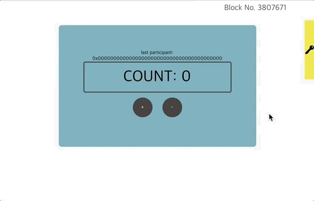

# Klaytn based application tutorial

## Table of Contents
* [Environment Setup](./1-environment-setup.md)
* [Scaffolding](./2-scaffolding.md)
* [Directory Structure](./3-directory-structure.md)
* [Write Smart Contract](./4-write-smart-contract.md)
* [Frontend Code Overview](./5-frontend-code.md)
  - [Frontend BlockNumber Component](./5-1-frontend-blocknumber-component.md)
  - [Frontend Auth Component](./5-2-frontend-auth-component.md)
  - [Frontend Count Component](./5-3-frontend-count-component.md)
* [Deploy Contract](./6-deploy-contract.md)
* [Run App](./7-run-app.md)

## Introduction

This is the introduction of our tutorial app.  
We will make an app with basic smart contract(`Count`).  
This app's features are simple: any user can plus or minus current value like above gif.  
